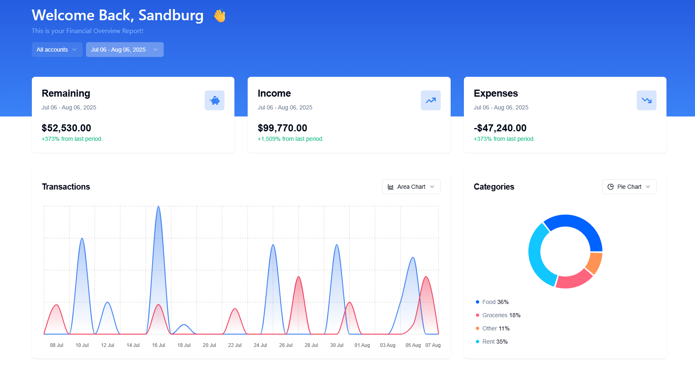

This is a [Next.js](https://nextjs.org) project bootstrapped with [`create-next-app`](https://nextjs.org/docs/app/api-reference/cli/create-next-app).

---

# Centsible | Personal Finance Dashboard
Centsible is a modern, interactive dashboard for tracking personal finances and visualizing budgets. It's a full-stack app built with security and a responsive experience in mind as it helps users take control of spending habits. 

---

## Features 
- Track income, expenses, and savings
- Visualize spending trends with charts and dashboards
- Add, edit, and remove transactions
- Secure authentication and user management via Clerk
- Efficient backend with RESTful API and PostgreSQL database
- Frontend state management and data fetching using TanStack React Query
- Type-safe backend with Zod validation
- Responsive design for desktop and mobile

---

## Tech Stack
- **Frontend:** Next.js, React, TypeScript  
- **Backend:** Hono.js RESTful API  
- **Database:** PostgreSQL with Drizzle ORM  
- **Authentication:** Clerk  
- **State Management & Data Fetching:** TanStack React Query  
- **Validation:** Zod  

---

# Installation
1. Clone the repo: `git clone https://github.com/yuddy-s/centsible.git`
2. Install dependencies: `npm install`
3. Start the dev server: `npm run dev`
4. Open `http://localhost:3000`
